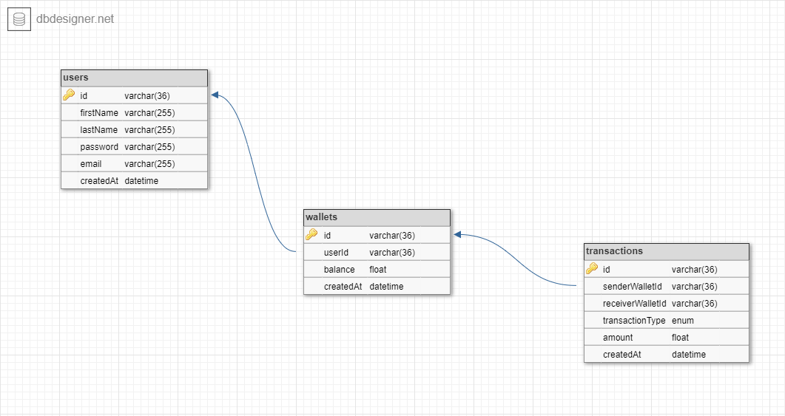

# lendsqr-backend-assessment

**Assessment for lendsquare's backend engineer task**

The goal of this project is to create an minimum viable product for demo credit which is a mobile lending app with wallet functionality so as to enable users

- create accounts
- fund accounts
- transfer funds to other users wallets
- withdraw funds

## Requirements

- [Nodejs](https://nodejs.org/en/) is a JavaScript runtime built on Chrome's V8 JavaScript engine.
- [Typescript](https://www.typescriptlang.org/) is a strongly typed programming language that builds on JavaScript, giving you better tooling at any scale.
- [Express](https://expressjs.com/) is a minimal and flexible Node.js web application framework that provides a robust set of features for web and mobile applications.
- [Mysql](https://www.mysql.com/) is a relational database management system based on the Structured Query Language, which is the popular language for accessing and managing the records in the database. MySQL is open-source and free software under the GNU license. It is supported by Oracle Company.
- [Knex](https://knexjs.org/) is a "batteries included" SQL query builder for PostgreSQL, CockroachDB, MSSQL, MySQL, MariaDB, SQLite3, Better-SQLite3, Oracle, and Amazon Redshift designed to be flexible, portable, and fun to use.

## Features

- Authentication
- Authorization
- Rate limiting
- Automated testing

## How to Setup

### Installation

```
$ npm install
```

### Running migrations

```
# development
$ npm run dev:migrate
```

```
# development
$ npm run prod:migrate
```

### Running the app

```
# development
$ npm run dev
```

```
# build
$ npm run build
```

```
# production
$ npm run start
```

```
# testing
$ npm run test
```

## Database design



## Authentication Endpoints

### **Register a New User**

**URL:** `/api/v1/auth/register`

**Method:** `POST`

**Description:** Register a new user.

**Request Body:**

```json
{
  "email": "johndoe@gmail.com",
  "password": "password123",
  "firstName": "John",
  "lastName": "Doe"
}
```

**Response:**

```json
{
  "message": "user registered successfully"
   "data" : {
    "userId":"5c32fe74-3986-4e20-b054-4e6a15d848bb",
    "firstName":"John",
    "lastName":"Doe",
    "email":"johndoe@gmail.com"
   }
}
```

### **Login a User**

**URL:** `/api/v1/auth/login`

**Method:** `POST`

**Description:** Login a user.

**Request Body:**

```json
{
  "email": "johndoe@gmail.com",
  "password": "password123"
}
```

**Response:**

```json
{
  "accessToken": "eyJhbGciOiJIUzI1NiIsInR5cCI6IkpXVCJ9..."
}
```

## Wallet Endpoints

### **Create a wallet**

**URL:** `/api/v1/wallet/create-wallet`

**Method:** `POST`

**Description:** Create a new wallet.

**Request Body:**

```json
{
  "userId": "5c32fe74-3986-4e20-b054-4e6a15d848bb"
}
```

**Response:**

```json
{
  "message": "wallet created"
   "data" : {
    "walletId":"6bd32e74-2386-rf20-b054-4e6a15d848bb",
    "balance":0,
    }
}
```

### **Get wallet**

**URL:** `/api/v1/wallet/user/:walletId`

**Method:** `GET`

**Description:** Get a user's wallet via user id.

**Request Params:**

```json
{
  "walletId": "5c32fe74-3986-4e20-b054-4e6a15d848bb"
}
```

**Response:**

```json
{
  "message": "wallet found"
   "data" : {
    "walletId":"6bd32e74-2386-rf20-b054-4e6a15d848bb",
    "balance":0,
    "createdAt": 17/5/2022
   }
}
```

## Transaction Endpoints

### **Get wallet transactions**

**URL:** `/api/v1/transaction/wallet/:walletId`

**Method:** `GET`

**Description:** Get all a wallet's transactions.

**Request Params:**

```json
{
  "walletId": "5c32fe74-3986-4e20-b054-4e6a15d848bb"
}
```

**Response:**

```json
{
  "message": "transaction details"
   "data" :[
    {},
    {}
   ]
}
```

### **Fund wallet**

**URL:** `/api/v1/transactions/fund-account/wallet/:walletId`

**Method:** `PATCH`

**Description:** Fund a user's wallet.

**Request Params:**

```json
{
  "walletId": "5c32fe74-3986-4e20-b054-4e6a15d848bb"
}
```

**Request Body:**

```json
{
  "amount": 500
}
```

**Response:**

```json
{
  "message": "account funded"
}
```

### **Transfer funds**

**URL:** `/api/v1/transactions/transfer/wallet/:senderWalletId/:recieverWalletId`

**Method:** `PATCH`

**Description:** Transfer funds to another wallet.

**Request Params:**

```json
{
  "senderWalletId": "5c32fe74-3986-4e20-b054-4e6a15d848bb",
  "recieverWalletId": "5c32fe74-3986-4e20-b054-4e6a15d848bb"
}
```

**Request Body:**

```json
{
  "amount": 500
}
```

**Response:**

```json
{
  "message": "transfer successful"
}
```

### **Withdraw funds**

**URL:** `/api/v1/transactions/withdrawal/wallet/:walletId`

**Method:** `PATCH`

**Description:** Withdraw funds from wallet.

**Request Params:**

```json
{
  "walletId": "5c32fe74-3986-4e20-b054-4e6a15d848bb"
}
```

**Request Body:**

```json
{
  "amount": 500
}
```

**Response:**

```json
{
  "message": "withdrawal successful"
}
```

### **Get transactions**

**URL:** `/api/v1/transactions/wallet/:walletId`

**Method:** `GET`

**Description:** Get all wallet's transactions.

**Request Params:**

```json
{
  "walletId": "5c32fe74-3986-4e20-b054-4e6a15d848bb"
}
```

**Response:**

```json
{
  "message": "transaction details",
  "data": [{}, {}]
}
```
